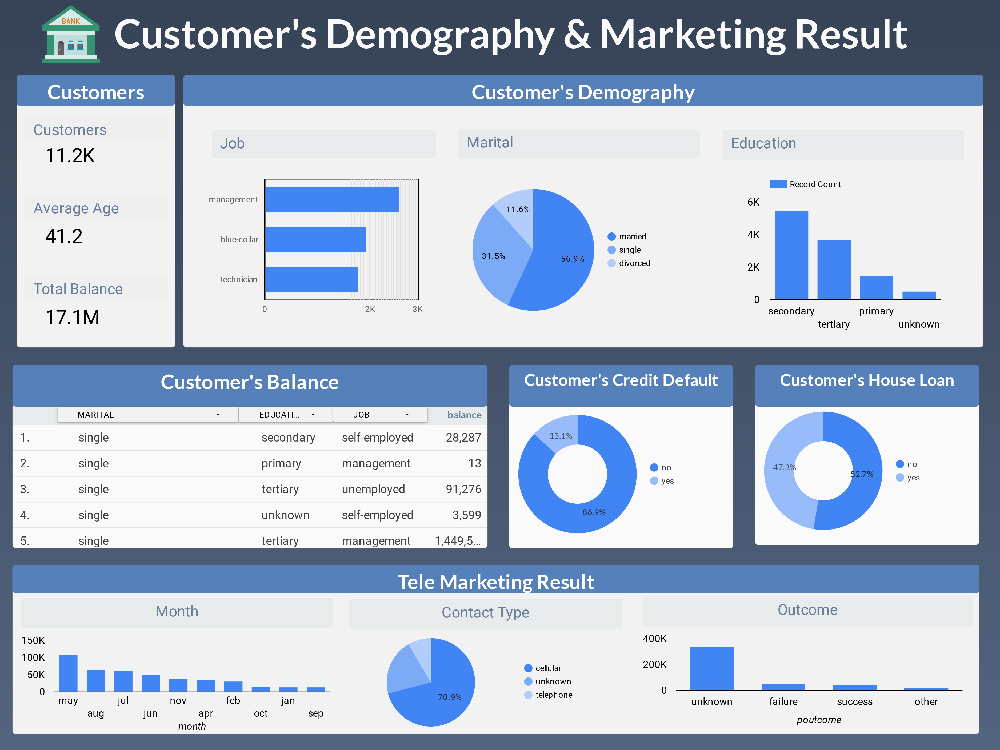

# Bank Marketing Demographic Insights Dashboard

In the realm of marketing, data-driven decisions reign supreme. Dive into a wealth of insights that promise to reshape your campaign strategies. From optimal timing to targeted engagement, this analysis uncovers the keys to unlocking success.

Get ready to explore a treasure trove of findings that hold the potential to revolutionize your marketing endeavors. Let's embark on a journey through the data landscape, where patterns emerge, and opportunities beckon. As we unravel the secrets behind effective campaigns, be prepared to discover strategies that could redefine your approach and elevate your results.

## Months of Marketing Activity
The analysis highlights May as the month with the highest marketing activity; however, it coincided with a substantial decline in term deposit offers acceptance (Lowest effective rate: -34.49%). For optimal results, the bank should focus its marketing campaigns during March, September, October, and possibly December (considering its lowest activity, warranting further exploration).

## Seasonality
Clients exhibit a preference for subscribing to term deposits during the fall and winter seasons. To enhance campaign impact, concentrate efforts during these periods.

## Campaign Calls 
Implement a policy of no more than 3 calls per potential client. Excessive calls can deter potential clients from opening term deposit accounts.

## Age Category
Target individuals in their 20s or younger and 60s or older for the upcoming campaign. The younger category showed a 60% subscription rate, while the eldest reached 76%. Focusing on these categories could significantly boost term deposit subscriptions.

## Occupation
Retirees and students are more likely to subscribe to term deposits. Retirees value interest payments, while students also engage. Capitalize on this insight for the campaign.

## House Loans and Balances
Clients with low or no balances tend to have house loans, impacting term deposit subscription likelihood. Prioritize average and high balance individuals to drive subscriptions.

## Developing a Questionnaire
Engagement during calls positively impacts subscription likelihood. Implementing a engaging questionnaire can enhance conversation length and engagement, ultimately increasing the probability of subscription.

## Targeting Individuals with Higher Duration
Prioritize individuals with a duration above 375, as they exhibit a high likelihood (78%) of opening a term deposit account. This strategy could substantially elevate campaign success rates.

*In Conclusion,* these insights offer a roadmap for optimizing the bank's marketing campaigns. By focusing on strategic timing, engagement tactics, and targeted segments, the next marketing campaign holds promising potential.

This analysis provides a snapshot of actionable insights, allowing the bank to refine its strategies effectively. As the bank embarks on its next marketing campaign, these findings can serve as a valuable guide.

For a visual representation of this project, check out the [https://lookerstudio.google.com/reporting/675f0601-a702-4486-a3a1-779c8d5d1b26](https://lookerstudio.google.com/reporting/675f0601-a702-4486-a3a1-779c8d5d1b26) 📊.

